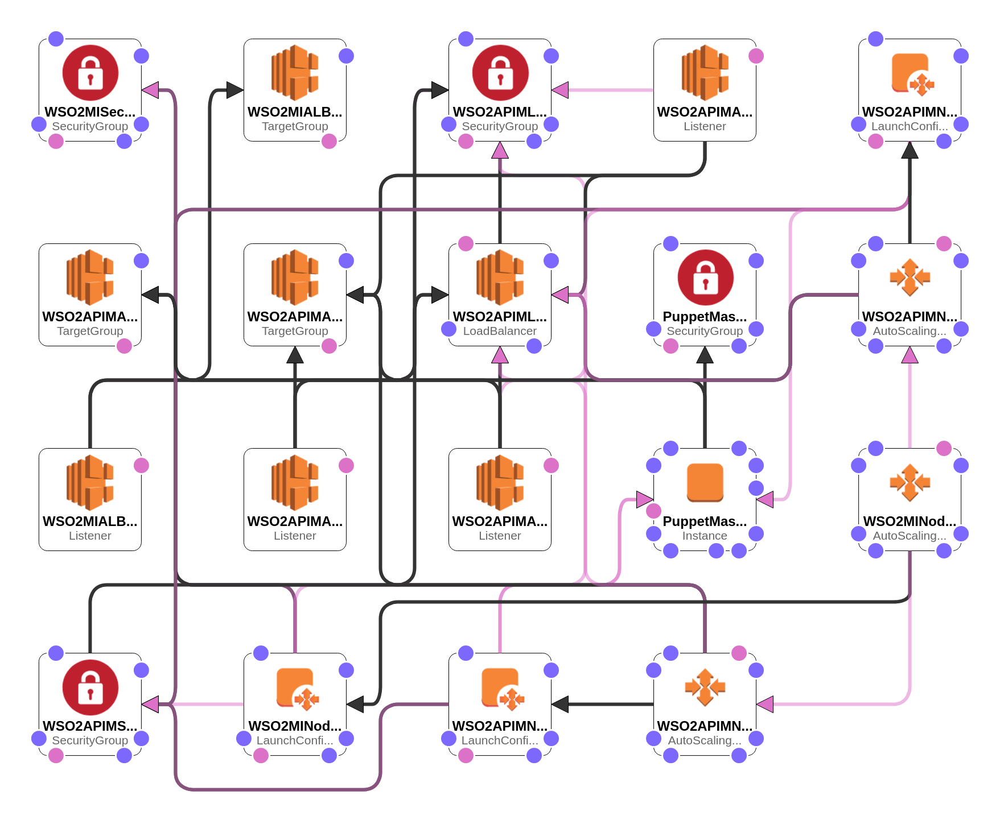

# WSO2 API Manager deployment with WSO2 Micro Integrator - Product Deployment

This is the final phase of deploying WSO2 API Manager deployment with WSO2 Micro Integrator. Use the [pattern-1.yaml](pattern-1.yaml) to set up the deployment.


## Design Overview



The WSO2 API Manager CloudFormation templates use Puppet to manage the server configurations and use the following AMIs to provision the deployment.

1. Puppet Master AMI - Contains the WSO2 API Manager Generally Available(GA) distribution, WSO2 Micro Integrator Generally Available(GA) distribution, and Puppet modules containing the configurations for API Manager deployment patterns.

2. APIM AMI - Contains the scripts that are required to create the Puppet catalog. Additionally, these AMIs contain the OS hardening recommended by WSO2. When EC2 instances start using the AMIs, the instances are updated to get the latest OS updates.

### Order of execution

1. Puppet Master
     - The latest OS updates and the required tools such as AWS CLI, Logstash, JDK, DB Connectors are installed in the Puppet master.
     - The scripts needed to add the latest updates to the WSO2 products are retrieved.
     - The latest updates for WSO2 servers are added to the residing GA WSO2 servers in the AMI.
     - Relevant configurations(IP addresses, DB URLs, etc.) are done to the puppet modules.
     - DB scripts are executed against the DB created in [Phase 2](../database/README.md).

2. API Manager (Puppet agent)
     - The latest OS updates and the required tools such as puppet agent, AWS CLI, Logstash, JDK, DB Connectors are installed in the puppet agent.
     - Puppet modules are retrieved from the Puppet master and the product is installed.
     - WSO2 servers are started.
   
3. Micro Integrator (Puppet agent)
   - The latest OS updates and the required tools such as puppet agent, AWS CLI, Logstash, JDK, DB Connectors are installed in the puppet agent.
   - Puppet modules are retrieved from the Puppet master and the product is installed.
   - WSO2 servers are started.

### Estimated Cost

```
$135.89 per month
```
The above cost is calculated upon the usage of default parameters given in the [pattern-1.yaml](pattern-1.yaml). If different inputs are chosen at the runtime, the cost may differ from the above.


## Things to note

- Update the CIDR blocks of the [pattern-1.yaml](pattern-1.yaml) as required to limit the traffic to/in your deployment as required.
